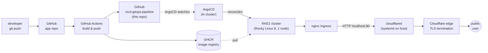

# CI/CD GitOps pipeline

End-to-end delivery from a developer push to a running pod on a self-hosted Kubernetes cluster: **GitHub Actions → GHCR → this repo (Kustomize overlays) → ArgoCD → RKE2 → nginx Ingress → Cloudflare Tunnel**. Three production applications currently ride this pipeline.

This repo is the manifest source of truth ArgoCD reconciles from. CI workflows in each application repo build images, push to GHCR, then commit a `kustomize edit set image` here. Per-app overlays live under `apps/`, the platform components that serve them under `infrastructure/`, end-to-end walkthroughs under `docs/`, and the architectural decisions behind the platform under `decisions/`.

| App | Live URL | Source |
|---|---|---|
| OT-edge asset tag generator | <https://getdfx.uk> | [`OT-edge-asset-tag-generator`](https://github.com/alexmchughdev/OT-edge-asset-tag-generator) |
| Personal site | <https://alexmchugh.dev> | [`alexmchugh-dev`](https://github.com/alexmchughdev/alexmchugh-dev) |
| FixMyCampus | <https://fixmycampus.alexmchugh.dev> | private |

## Architecture



Detailed walkthroughs and diagrams live in `docs/architecture.md`.

## Tech stack (currently in use)

| Layer | Component |
|---|---|
| Cluster | RKE2 v1.34.5 on Rocky Linux 9.7, single node |
| Container runtime | containerd 2.1.5 |
| Pod networking | rke2-canal (Calico + Flannel) |
| In-cluster DNS | rke2-coredns |
| Ingress | rke2-ingress-nginx 1.14.3 (bundled, runs in `kube-system`) |
| GitOps | ArgoCD (UI-registered Applications, no ApplicationSet) |
| Manifest layering | Kustomize (base + `overlays/production`) |
| CI | GitHub Actions |
| Image registry | GitHub Container Registry (GHCR), public images |
| Edge | Cloudflare Tunnel (`cloudflared` systemd unit on the host) |
| DNS | Cloudflare |
| Database (one app only) | MongoDB Atlas (managed, off-cluster) |

Confirmed via `kubectl get pods -A` and `helm list -A`. Anything not in the table above is not deployed.

## Apps

### OT-edge asset tag generator
Go microservice issuing UUID-based asset tags + QR codes for OT edge devices. Source: [`alexmchughdev/OT-edge-asset-tag-generator`](https://github.com/alexmchughdev/OT-edge-asset-tag-generator). Public URL: <https://getdfx.uk>.

### alexmchugh-dev
Personal website (Next.js, statically built and served by nginx). Source: [`alexmchughdev/alexmchugh-dev`](https://github.com/alexmchughdev/alexmchugh-dev). Public URL: <https://alexmchugh.dev>. Cloudflare Tunnel → nginx Ingress → frontend Service.

### FixMyCampus
React (Vite) + Express + MongoDB Atlas; campus maintenance reports. Source repo is private. Public URL: <https://fixmycampus.alexmchugh.dev>. nginx in the frontend pod reverse-proxies `/api/` to the backend Service so the SPA stays same-origin.

## Delivery flow

Every app follows the same shape: GitHub Actions builds an image, pushes to GHCR, then commits a `kustomize edit set image` to this repo. ArgoCD reconciles from `apps/<app>/overlays/production/`. See `docs/architecture.md` for the end-to-end walkthrough and `decisions/` for the choices behind it.

## Repository layout

```
apps/
  ot-edge-asset-tag-generator/{base,overlays/production}/
  alexmchugh-dev/{base,overlays/production}/
  fixmycampus/{base,overlays/production}/
infrastructure/
  argocd/README.md            # what's running, install method, known issues
  ingress-nginx/README.md     # bundled with RKE2; not in this repo
  cloudflare-tunnel/README.md # systemd unit on host; config not committed
docs/
  architecture.md
  runbook.md
  diagrams/
decisions/
  0001-cloudflare-tunnel-over-cert-manager.md
  0002-gitops-with-argocd.md
  0003-per-app-deployment-scaffolding.md
README.md
```

## Roadmap (planned, not yet implemented)

- Roll the OT-edge supply chain pipeline (Trivy fs + image scan, Cosign keyless signing, Syft SBOM, language-appropriate vulnerability scanning, TruffleHog) out to `fixmycampus` and `foghorn`. `lookout` will reach the equivalent assurance via goreleaser + SLSA L3 because it ships a published binary rather than a container. Reference implementations: OT-edge (Go) and `alexmchugh-dev` (Node/Next.js); see `decisions/0004-supply-chain-security-in-ci.md`.
- Static analysis (Semgrep in CI).
- Policy enforcement (Kyverno) for things like "no `:latest` tags in Deployments", "non-root containers", "resource limits set". A later phase will add `verifyImages` to require a valid Cosign signature on every pulled image, building on the signing now in place for OT-edge and `alexmchugh-dev` (`decisions/0004`).
- Secret management with SealedSecrets or sops, replacing the current "apply secret out-of-band + annotate to skip ArgoCD" pattern.
- Observability stack: Prometheus + Grafana for metrics, Loki for logs, optionally Jaeger for tracing.
- Multi-environment overlays (`overlays/staging`, `overlays/production`) and a staging cluster.
- ApplicationSet auto-discovery of `apps/*/overlays/production/` to replace manual Application registration. Blocked on a separate fix: the in-cluster `argocd-applicationset-controller` is currently in CrashLoopBackOff (see `infrastructure/argocd/README.md`).
- High-availability cloudflared (multiple replicas across hosts) once the cluster has more than one node.

Each item is a one-liner because none of them are partially done.
