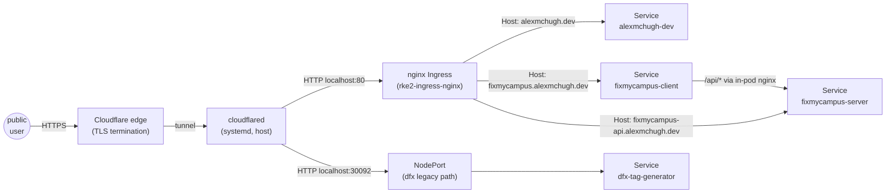
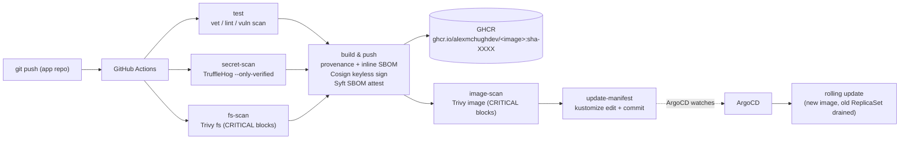
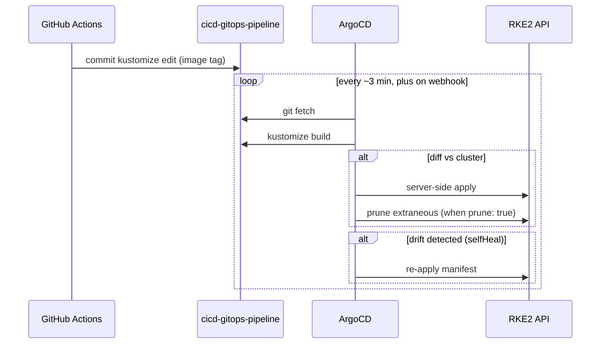

# Architecture

How a commit becomes a deployment, end-to-end. Every app's CI lands in this manifest repo and reconciles through ArgoCD.

## Cluster topology

Single-node RKE2 v1.34.5 on Rocky Linux 9.7. The host runs on the home LAN with no static public IP. There is no second node, no second cluster, and no port forwarding from the home router. Public reachability is provided exclusively by Cloudflare Tunnel (`decisions/0001`).

Cluster components (confirmed via `kubectl get pods -A`):

- `kube-system`: rke2-canal, rke2-coredns, rke2-ingress-nginx, rke2-metrics-server, kube-apiserver, etcd, controller-manager, scheduler, kube-proxy.
- `argocd`: application controller, dex, notifications, redis, repo server, server. (ApplicationSet controller is in CrashLoopBackOff; not used.)
- One namespace per app: `alexmchugh-dev`, `dfx`, `fixmycampus`.

External components (not in cluster):

- `cloudflared` runs as a `systemctl` unit on the cluster host.
- MongoDB Atlas (managed, off-cluster) for FixMyCampus.

## Repo structure recap

```
apps/<app>/base/                   shared manifests
apps/<app>/overlays/production/    image-pinned overlay; CI bumps tags here
infrastructure/<component>/        per-component README; manifests live elsewhere
docs/, decisions/, README.md
```

Each `apps/<app>/overlays/production/kustomization.yaml` carries the active image tag. CI updates these files; ArgoCD reads them.

## Network flow



Two ingress patterns coexist:

- **Most apps** (alexmchugh-dev, fixmycampus): cloudflared → `localhost:80` → nginx Ingress controller → Service.
- **dfx-tag-generator**: cloudflared → `localhost:30092` → NodePort Service. Bypasses the Ingress entirely. This is legacy and inconsistent; tracked in `decisions/0003`.

TLS is always terminated at Cloudflare's edge. The cluster speaks plain HTTP. Ingress objects set `nginx.ingress.kubernetes.io/ssl-redirect: "false"` to prevent the controller from issuing 308 redirects that would loop with the tunnel.

For FixMyCampus specifically, the SPA's nginx pod also reverse-proxies `/api/` to the backend Service, so the React code stays same-origin and CORS is not needed.

## CI/CD flow



- Build and manifest update are gated stages of a single workflow. The `update-manifest` job runs only after every prior stage is green (tests, secret scan, filesystem scan, signed build with SBOM attestation, image scan), so a failed gate never leaves the cluster on a half-applied state. Apps that have not yet adopted the supply chain stack run the simpler two-job shape (build then bump).
- Image tag is `sha-<short-sha>` of the app source commit. Mutable tags (`latest`) are not used in production overlays.
- The CI runner needs `MANIFEST_DEPLOY_KEY` (an SSH private key with write access to this repo) to push. The public half is registered as a deploy key on this repo.

OT-edge and `alexmchugh-dev` have extended this baseline with a multi-stage supply chain pipeline: language-appropriate test/lint/vulnerability scan (OT-edge runs `go vet`, `go test -race`, `golangci-lint`, `govulncheck`; `alexmchugh-dev` runs `tsc --noEmit`, `next lint`, `npm audit`, OSV-Scanner), TruffleHog verified-secret scan, Trivy filesystem scan, signed build (Cosign keyless OIDC), Syft SBOM (SPDX + CycloneDX, attested by Cosign), and a Trivy image scan, all gating the `update-manifest` job. The two-job contract is preserved at a higher level: nothing is committed to this repo unless every prior stage is green. `decisions/0004-supply-chain-security-in-ci.md` covers the rationale; `fixmycampus` and `foghorn` will pick up the same shape over time.

`fixmycampus` is a small variation: its Dockerfile and CI workflow live in a sidecar `fixmycampus-infra` repo rather than alongside the application source, and the build is triggered manually via `gh workflow run`. Same end state — a `kustomize edit` commit on this repo. See `decisions/0003`.

## GitOps reconciliation flow



Sync settings on every Application:

- `automated.prune: true` — resources removed from git are deleted from the cluster.
- `automated.selfHeal: true` — manual `kubectl edit` is reverted within minutes.
- `syncOptions: [CreateNamespace=true, ServerSideApply=true]` — namespaces auto-created; SSA preserves field ownership for resources also touched out-of-band.
- `RespectIgnoreDifferences=true` (FixMyCampus only) — combined with the `argocd.argoproj.io/compare-options: IgnoreExtraneous` annotation on the secret, this keeps ArgoCD from clobbering the out-of-band Atlas secret.

## Secret management (current)

The platform deliberately keeps secrets out of git. There is no SealedSecrets, no sops, no Vault integration today (all on the roadmap).

Pattern in use:

1. The deployment manifest references a `Secret` by name (e.g. `fixmycampus-secrets`).
2. The manifest does **not** carry a placeholder `Secret` resource.
3. The operator creates the real secret out-of-band:
   ```
   kubectl -n <ns> create secret generic <name> --from-literal=KEY=value
   ```
4. The operator annotates the secret so ArgoCD ignores it:
   ```
   kubectl -n <ns> annotate secret <name> argocd.argoproj.io/compare-options=IgnoreExtraneous
   ```

The runbook captures the exact commands, including how to rotate.

This is a known deficiency. SealedSecrets is the planned replacement; it lets encrypted secrets be committed alongside other manifests and decrypted by an in-cluster controller.

## Application registration (current)

ArgoCD Applications are registered manually:

- Two apps (alexmchugh-dev, fixmycampus) keep their `Application` YAML in their respective source repos and apply it from a public raw URL during bring-up.
- One app (dfx-tag-generator) was registered through the ArgoCD UI; no committed Application manifest exists yet.

An ApplicationSet that auto-discovers `apps/*/overlays/production/` would replace this manual step. Blocked on the in-cluster ApplicationSet controller being in CrashLoopBackOff — fix is on the roadmap.

## Failure modes worth knowing

- **cloudflared down** → all four hostnames go offline. Single point of failure; mitigation deferred until the cluster has a second host.
- **MANIFEST_DEPLOY_KEY rotated without updating all CI repos** → image builds succeed but tag bumps fail. The previous image keeps serving until corrected.
- **Image tag bump committed but image not actually pushed** → ArgoCD pulls, gets ImagePullBackOff. The previous ReplicaSet keeps serving traffic until the missing image is pushed (or the bump is reverted).
- **ApplicationSet controller crash** → no current effect because no ApplicationSet resources are in use. Will become an issue when migrating to auto-discovery.
- **Cloudflare DNS propagation lag** → newly added hostnames sometimes 30–120s before resolving on every client. Safari and macOS `mDNSResponder` have been observed holding NXDOMAIN longer than other resolvers.
